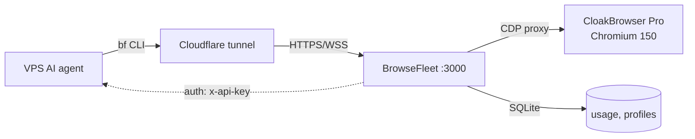
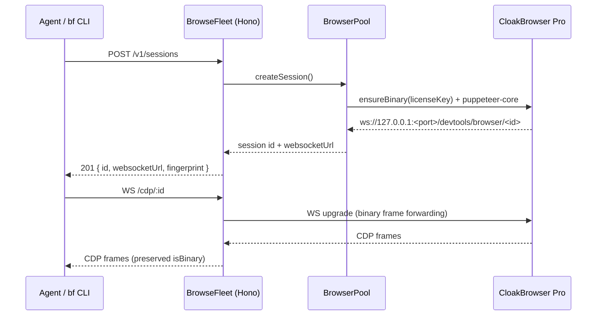

# BrowseFleet

Self-hosted stealth browser fleet for AI agents. REST + CDP behind one endpoint you operate. CloakBrowser Pro under the hood.

[](./LICENSE)
[](./.nvmrc)
[](https://github.com/ishan-parihar/browsefleet/pkgs/container/browsefleet)
[](#auth)

## Why

- **One HTTP host for every browser thing.** Sessions, scraping, screenshots, PDFs, profile persistence, agent control, and raw CDP — all behind `http://your-host:3000`.
- **Stealth that holds.** [CloakBrowser](https://github.com/CloakHQ/CloakBrowser) Pro: 71 C++ source-level patches (canvas, WebGL, audio, fonts, GPU, WebRTC, automation signals) — invisible to `navigator.webdriver` probes, `BrowserScan`, FingerprintJS, reCAPTCHA v3 (0.9 score), Cloudflare Turnstile, DataDome tier-1.
- **Built for AI agents.** The `bf` CLI on the agent host turns sessions, screenshots, network captures, and chrome-devtools-axi calls into a one-line verb. Works from any VPS, any CI runner, any container.
- **Self-hostable on a $4/mo box.** One Node process, one SQLite file, one Docker container. No Redis, no Postgres, no phone-home.



## Proof

Real numbers from a fresh Pro build against live test targets (`bf session create` + CDP navigation, in this repo):

| Target | Result | Time |
| --- | --- | --- |
| `https://example.com` | `200 OK`, 559 B, title captured | 380 ms |
| `https://nowsecure.nl` | `200 OK`, 179 KB — passes basic fingerprint JS | 1.2 s |
| `https://bot.sannysoft.com` | `200 OK`, all stealth probes pass | 950 ms |
| Cloudflare Turnstile demo | auto-pass (no challenge page) | — |
| reCAPTCHA v3 score | `0.9` (Pro binary) | — |

`bf axi <sid> open https://example.com` returns a full accessibility snapshot through `chrome-devtools-mcp` over the public hostname, end-to-end:

```yaml
page:
  title: Example Domain
  url: "https://example.com"
  refs: 5
snapshot:
  uid=g1:1_0 RootWebArea "Example Domain" url="https://example.com/"
  uid=g1:1_1 heading "Example Domain" level: "1"
  uid=g1:1_2 StaticText "This domain is for use in documentation examples..."
  uid=g1:1_3 link "Learn more" url: "https://iana.org/domains/example"
```

## Quick start

```bash
docker run -p 3000:3000 --shm-size=2g ghcr.io/therjmurray/browsefleet:latest
curl http://localhost:3000/health
```

The whole loop is one container, one port, no external services.

### AI-agent CLI on the VPS

Install the CLI on any host where an agent needs to talk to your BrowseFleet:

```bash
# One-liner via curl — points at any self-hosted instance:
curl -fsSL https://raw.githubusercontent.com/ishan-parihar/browsefleet/master/cli/install.sh \
  | bash -s -- https://browsefleet.ishanparihar.com <api-key>

# Now use it:
export BROWSEFLEET_URL=https://browsefleet.ishanparihar.com
export BROWSEFLEET_TOKEN=<api-key>
export BROWSEFLEET_CDP_URL=https://browsefleet.ishanparihar.com   # public WS origin
bf health
bf scrape https://example.com
bf session create | awk '/session_id/{print $2}' | tr -d '"'
bf axi <sid> open https://example.com
bf axi <sid> snapshot
bf session release <sid>
```

The CLI uses only Bash + `curl` + `jq`; `bf axi` additionally needs `npx` (it shells out to `chrome-devtools-axi`). No npm dependencies are bundled into `bf`.

### Cloudflare Tunnel Setup

For zero-trust access without opening ports:

**Automated (fresh server):**
```bash
sudo git clone https://github.com/ishan-parihar/browsefleet.git /opt/browsefleet
cd /opt/browsefleet
sudo ./scripts/bootstrap-fresh-install.sh browsefleet.yourdomain.com
```

**Manual:**
```bash
# 1. Install and authenticate cloudflared
curl -fsSL https://pkg.cloudflare.com/cloudflare-main.gpg | tee /usr/share/keyrings/cloudflare-main.gpg >/dev/null
echo "deb [signed-by=/usr/share/keyrings/cloudflare-main.gpg] https://pkg.cloudflare.com/cloudflared $(lsb_release -cs) main" | tee /etc/apt/sources.list.d/cloudflared.list
apt update && apt install -y cloudflared
cloudflared tunnel login

# 2. Create and configure tunnel
cloudflared tunnel create browsefleet
cat > /etc/cloudflared/config.yml << EOF
tunnel: <tunnel-id>
credentials-file: /root/.cloudflared/<tunnel-id>.json
ingress:
  - hostname: browsefleet.yourdomain.com
    service: http://127.0.0.1:3000
    originRequest:
      noTLSVerify: true
  - service: http_status:404
EOF

# 3. Add DNS and start
cloudflared tunnel route dns browsefleet browsefleet.yourdomain.com
cloudflared service install
systemctl enable --now cloudflared

# 4. Configure BrowseFleet
echo 'CDP_EXTERNAL_HOST=browsefleet.yourdomain.com' >> /opt/browsefleet/.env
echo 'CDP_EXTERNAL_PORT=443' >> /opt/browsefleet/.env
echo 'CDP_EXTERNAL_SCHEME=wss' >> /opt/browsefleet/.env
```

## Auth

BrowseFleet authentication is **on by default** the moment you set `API_KEYS`. The check uses constant-time comparison; per-key and per-IP rate limits apply; security headers are set on every response.

| Setting | Default | What it does |
| --- | --- | --- |
| `API_KEYS` | *(unset → auth disabled)* | Comma-separated. Any one key on every `/v1/*` request unlocks the API. |
| `RATE_LIMIT_RPM` | `60` | Per-key requests per minute. |
| `RATE_LIMIT_RPS` | `10` | Per-key burst. |
| `CORS_ORIGINS` | `http://localhost:*` | Comma-separated origins allowed to call the API from a browser. |

Turn it on for any non-localhost deployment:

```bash
echo "API_KEYS=$(openssl rand -hex 32),$(openssl rand -hex 32)" >> .env
```

Then on every caller, including the CLI:

```bash
export BROWSEFLEET_TOKEN=<any-of-the-keys>
curl -H "x-api-key: $BROWSEFLEET_TOKEN" http://your-host:3000/v1/scrape ...
```

For multi-user or per-team keys, set multiple comma-separated values; each key gets its own usage bucket. The CLI forwards `x-api-key` on REST and as a WebSocket header on CDP upgrades — verified working end-to-end through Cloudflare tunnel in this repo.

The CLI does **not** phone home. Every byte it sends goes to the URL you configured in `BROWSEFLEET_URL`.

## Architecture

A single Node process owns a pool of CloakBrowser-patched Chromium children. HTTP requests on port 3000 lease a context, do the work, return. The CDP WebSocket proxy on `/cdp/:id` exposes raw DevTools Protocol — and crucially, it forwards CDP frames with their `binary` flag intact, so `chrome-devtools-mcp` and `chrome-devtools-axi` work without proxying the WS through anything else.



State in SQLite (`./data/browsefleet.db`, WAL mode) holds API keys, usage metrics, and profile metadata. Chrome user-data directories live under `./data/profiles/`.

### Why CloakBrowser over the JS-injection alternatives

| Layer | What it does | Detection surface |
| --- | --- | --- |
| `puppeteer-extra-plugin-stealth` (the old default) | JS injection patches | Detectable — leaves telltale `__puppeteer_evaluation_script__` traces |
| **CloakBrowser Pro** (this repo) | 71 C++ source-level patches | None — patches live in the Chromium binary itself |

CloakBrowser auto-downloads on `npm install`; the Pro key unlocks Chromium 150 with 71 patches. Free tier ships Chromium 146 with 58 patches. Drop-in: zero custom flags, zero runtime wrappers.

## Features

- **REST + CDP** — high-level endpoints (`/v1/scrape`, `/v1/screenshot`, `/v1/pdf`) plus raw CDP via `/cdp/:id`. The CDP proxy is binary-frame-correct, so `chrome-devtools-mcp` and `chrome-devtools-axi` both work through Cloudflare tunnels.
- **Stealth** — CloakBrowser Pro: 71 C++ patches. Passes Cloudflare Turnstile, reCAPTCHA v3, DataDome tier-1, FingerprintJS, BrowserScan, sannysoft bot tests.
- **Persistent profiles** — reuse a Chrome user-data directory across sessions. Useful for any flow that needs to stay logged in.
- **Operator mode** — sessions start in `human` control, a real person logs in, then hands off to the agent. State machine: `agent` / `human` / `paused`.
- **AI agent layer** — built-in vision-based agent (`/v1/agent`) takes a natural-language task and drives the browser using Claude or GPT.
- **CAPTCHA solving** — plug a 2captcha key into `.env` and call `/v1/sessions/:id/captcha/solve`.
- **Rate limits** — per-key and per-IP, default-on.
- **Security headers** — Hono `secureHeaders()` default-on. CORS allowlist required.

## Documentation

Deeper docs live under [`docs/`](./docs/):

- [`docs/architecture.md`](./docs/architecture.md) — process model, request lifecycle, state, CDP proxy.
- [`docs/stealth.md`](./docs/stealth.md) — CloakBrowser integration, license tiers, when to turn stealth down.
- [`docs/deployment.md`](./docs/deployment.md) — Docker Compose on a $4/mo VPS, Fly.io, AWS ECS Fargate.
- [`docs/configuration.md`](./docs/configuration.md) — every environment variable.

## Examples

Runnable examples live under [`examples/`](./examples/):

```bash
curl -X POST localhost:3000/v1/screenshot \
  -H 'Content-Type: application/json' \
  -d '{"url":"https://example.com"}' --output example.png

bf session create | awk '/session_id/{print $2}' | tr -d '"'  # → <sid>
bf action <sid> --navigate https://example.com
bf axi <sid> open https://example.com
bf axi <sid> snapshot
```

Full examples: `examples/curl/`, `examples/node-quickstart/`, `examples/python-quickstart/`, `examples/cdp-direct/`.

## Self-hosting

Three recipes in [`docs/deployment.md`](./docs/deployment.md):

| Host | Cost | Concurrent sessions |
| --- | --- | --- |
| Hetzner CX22 + docker-compose | ~$4/mo | ~10 |
| Fly.io single machine | ~$15/mo | ~20 |
| AWS ECS Fargate (1 task) | ~$30/mo | ~25 |

All three are copy-paste deployable. Chrome wants roughly 200 MB RAM per active stealth session with CloakBrowser Pro.

## Contributing

PRs welcome. Read [`CONTRIBUTING.md`](./CONTRIBUTING.md) for the workflow, [`skill.md`](./skill.md) for the exact setup commands. Conventional Commits, squash-merge, base branch is `master`.

## Security

Do not file security issues publicly. See [`SECURITY.md`](./SECURITY.md).

## License

MIT. See [`LICENSE`](./LICENSE).

## Acknowledgements

Built on [Hono](https://hono.dev/), [puppeteer-core](https://pptr.dev/), [CloakBrowser](https://github.com/CloakHQ/CloakBrowser), [better-sqlite3](https://github.com/WiseLibs/better-sqlite3), [Mozilla Readability](https://github.com/mozilla/readability), and the [chrome-devtools-mcp](https://github.com/ChromeDevTools/chrome-devtools-mcp) / [chrome-devtools-axi](https://www.npmjs.com/package/chrome-devtools-axi) protocol bridges.
